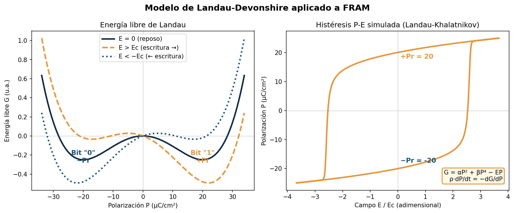
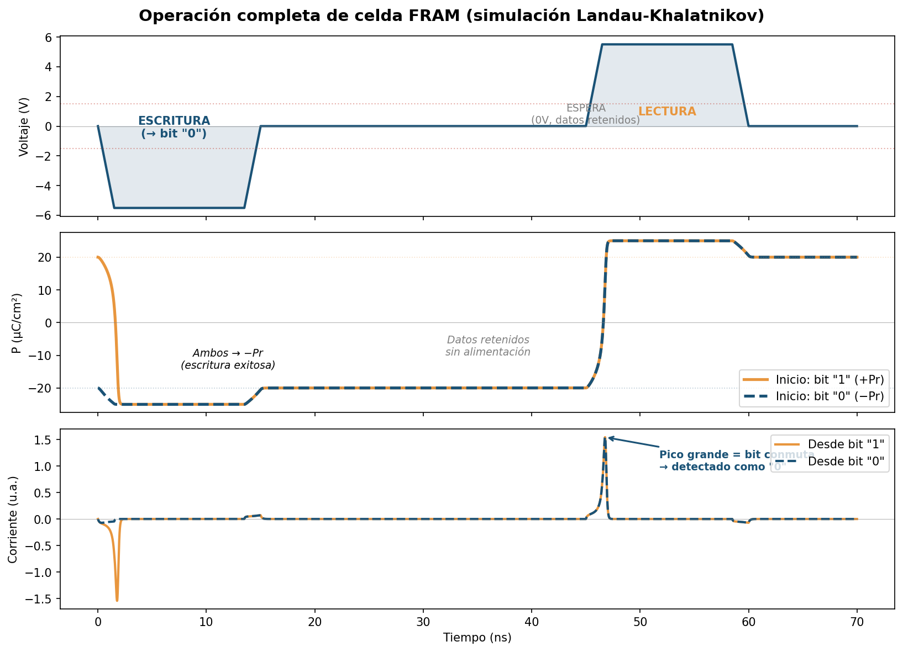
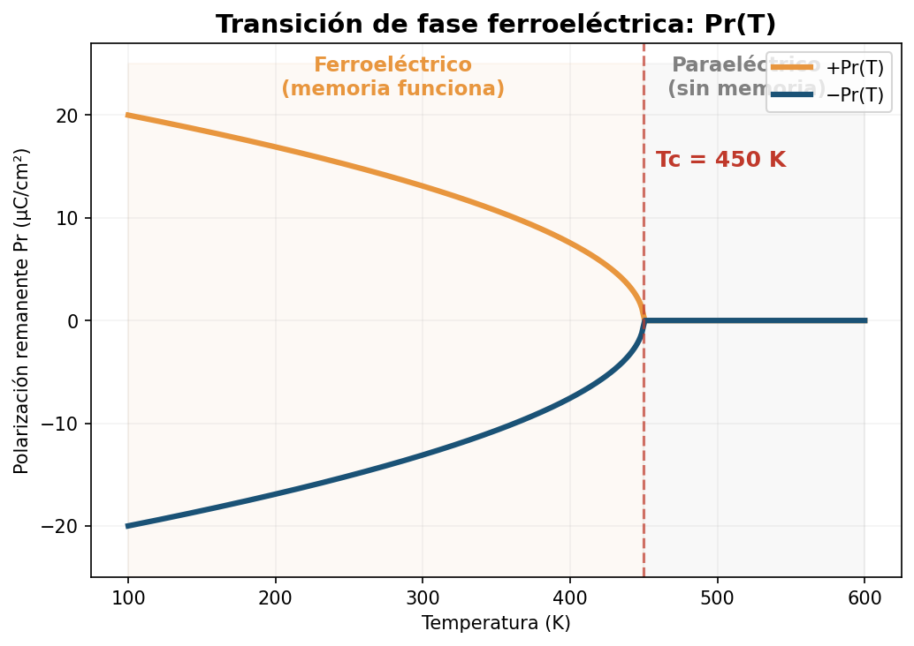

# FRAM Cell Simulation — Landau-Khalatnikov Model

Numerical simulation of a **Ferroelectric RAM (FRAM)** cell using the **Landau-Devonshire** free energy and **Landau-Khalatnikov** polarisation dynamics. Models the full read/write operation, P-E hysteresis, and ferroelectric phase transition for HfO₂-based memory cells.

---

## Physical Model

### Landau-Devonshire Free Energy

The ferroelectric state is described by the Landau-Devonshire free energy density as a function of polarisation $P$ and applied electric field $E$:

$$G(P) = \alpha P^2 + \beta P^4 - E \cdot P$$

For $\alpha < 0$ and $\beta > 0$, $G(P)$ has a **double-well** shape with two stable minima at $\pm P_r$ (remanent polarisation), representing the two binary states of the memory cell.

### Landau-Khalatnikov Dynamics

The temporal evolution of the polarisation follows the **Landau-Khalatnikov** equation:

$$\rho \frac{dP}{dt} = -\frac{\partial G}{\partial P} = E - 2\alpha P - 4\beta P^3$$

where $\rho$ is a damping coefficient. This is a first-order relaxation equation that drives $P$ towards the nearest energy minimum.

### Measured Current

The current sensed by the read circuit is proportional to the rate of polarisation change:

$$i(t) = A \cdot \frac{dP}{dt}$$

A large current pulse signals a polarisation reversal (bit switch); a small pulse indicates no reversal.

### Device Parameters (HfO₂-based FRAM)

| Parameter | Symbol | Value | Typical range |
|-----------|--------|-------|---------------|
| Remanent polarisation | $P_r$ | 20 µC/cm² | 10–25 µC/cm² |
| Coercive field | $E_c$ | 1.5 MV/cm | 1–2 MV/cm |
| Oxide thickness | $d$ | 10 nm | 5–20 nm |
| Coercive voltage | $V_c = E_c \cdot d$ | 1.5 V | — |
| Curie temperature | $T_c$ | 450 K | 400–500 K |

---

## Simulation

### Figure 1 — Landau Free Energy and P-E Hysteresis

<p align="center">
  
</p>

**Left:** The double-well free energy $G(P)$ for three field values. At $E = 0$ both minima $\pm P_r$ are equally stable (the two memory states). Applying $E > E_c$ tilts the well and stabilises only $+P_r$ (write "1"); $E < -E_c$ stabilises only $-P_r$ (write "0").

**Right:** The simulated P-E hysteresis loop obtained by integrating the Landau-Khalatnikov equation under a triangular AC field. The loop is characteristic of a ferroelectric: $P$ switches sharply at $\pm E_c$ and retains the written state when the field is removed.

---

### Figure 2 — Full FRAM Cell Operation: Write → Wait → Read

<p align="center">
  
</p>

The simulation applies a three-phase voltage sequence:

1. **Write (0–15 ns):** A negative pulse $V = -V_c$ drives both polarisation states to $-P_r$ (write bit "0"). The orange curve (initial state "1") undergoes switching; the blue curve (initial state "0") remains.

2. **Wait (15–45 ns):** Voltage is removed. Both curves remain at $-P_r$, demonstrating **non-volatile retention** — data is preserved without power.

3. **Read (45–60 ns):** A positive pulse $V = +V_c$ is applied.
   - A cell that stored "1" must switch $P$ from $-P_r$ to $+P_r$ → **large current pulse** (detected as "0", destructive read).
   - A cell that stored "0" has $P$ already near $-P_r$ → **small current pulse**.

The read is **destructive** (as in real FRAM): a rewrite step is needed to restore the original data.

---

### Figure 3 — Ferroelectric Phase Transition $P_r(T)$

<p align="center">
  
</p>

Above the **Curie temperature** $T_c = 450$ K the material becomes paraelectric: the double-well collapses into a single minimum at $P = 0$ and the memory effect disappears. Below $T_c$, the remanent polarisation follows:

$$P_r(T) \propto \sqrt{T_c - T} \qquad (T < T_c)$$

This sets the **operating temperature limit** of the FRAM cell.

---

## Code Structure

```
.
├── scripts/
│   └── FRAM.py          # Main simulation script
├── figures/
│   ├── landau_hysteresis.png   # Free energy and P-E hysteresis
│   ├── fram_operation.png      # Write → Wait → Read operation
│   └── phase_transition.png    # Pr(T) phase transition
└── README.md
```

The script is self-contained and parameterised at the top — all physical parameters ($P_r$, $E_c$, $d$, $T_c$) can be changed to explore different ferroelectric materials.

---

## Requirements

```
numpy  matplotlib
```

```bash
pip install numpy matplotlib
```

---

## Usage

```bash
python scripts/FRAM.py
```

Generates and saves all three figures to `figures/`.

---

## References

1. A. F. Devonshire, "Theory of barium titanate", *Phil. Mag.* **40**, 1040 (1949)
2. L. Landau & I. Khalatnikov, *Dokl. Akad. Nauk SSSR* **96**, 469 (1954)
3. M. Pešić et al., "Physical mechanisms behind the field-cycling behavior of HfO₂-based ferroelectric capacitors", *J. Comput. Electron.* (2017) — HfO₂ parameters

---

## Author

**A. S. Amari Rabah**

Developed as part of the coursework for *Characterization, Simulation and Modeling of Electronic Nanodevices* —
Master's Degree in Physics: Radiation, Nanotechnology, Particles and Astrophysics,
University of Granada, Spain.
